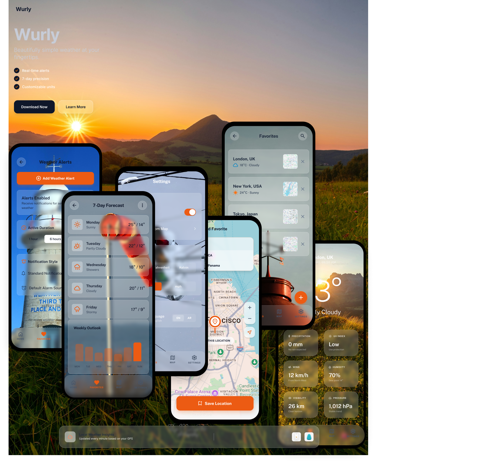

# 🌦️ Wurly - Modern Weather App



Wurly is a premium, feature-rich weather application for Android that provides real-time weather updates with a stunning glassmorphism design. Built using the latest Android development standards, Wurly focuses on performance, reliability, and a superior user experience.

---

## ✨ Features

- **Real-time Weather**: Accurate current weather conditions and detailed multi-day forecasts.
- **Premium Design**: Beautiful **Glassmorphism** UI components for a modern, high-end feel.
- **Offline Support**: Robust caching mechanism using Room, allowing access to weather data even without an internet connection.
- **Active Alerts**: Background weather alerts and synchronization using WorkManager.
- **Search & Favorites**: Search for any city globally and save your favorites.
- **Secure Integration**: Sensitive API keys and base URLs are protected using **JNI/C++** binary representation.

---

## 🛠️ Technology Stack

Wurly is built with a focus on modern Android development practices:

- **UI Layer**: [Jetpack Compose](https://developer.android.com/jetpack/compose) - Modern declarative UI toolkit.
- **Asynchrony**: [Kotlin Coroutines](https://kotlinlang.org/docs/coroutines-overview.html) & [Flow](https://kotlinlang.org/docs/flow.html) - For reactive data streams.
- **Dependency Injection**: [Hilt](https://developer.android.com/training/dependency-injection/hilt-android) - Standard DI library for Android.
- **Networking**: [Retrofit](https://square.github.io/retrofit/) & [Serialization](https://github.com/Kotlin/kotlinx.serialization) - For API communication and JSON parsing.
- **Persistence**: [Room](https://developer.android.com/training/data-storage/room) - SQLite abstraction for local data storage and caching.
- **Settings**: [Jetpack DataStore](https://developer.android.com/topic/libraries/architecture/datastore) - Typed preference storage.
- **Location**: [Mapbox Location SDK](https://www.mapbox.com/android-docs/location-sdk/overview/) - High-precision location services.
- **Background Jobs**: [WorkManager](https://developer.android.com/topic/libraries/architecture/workmanager) - For periodic syncing and alert scheduling.

---

## 🏗️ Architecture

The project follows **Clean Architecture** principles to ensure scalability, testability, and maintainability.

- **Data**: Implementation of repositories, local/remote data sources, and database entities.
- **Domain**: Pure Kotlin module containing Business logic, Use Cases, and Domain Models.
- **Presentation**: UI components, State management (MVI/MVVM), and ViewModels.
- **Glass Module**: A dedicated UI library for Glassmorphism effects.

---

## 🚀 Getting Started

### Prerequisites

- Android Studio **Ladybug** (2024.2.1) or newer.
- JDK 17 or 21.
- NDK & CMake (for C++ key provider).

### Configuration

1. **Mapbox Token**: Add your Mapbox token to `secrets.properties` in the root directory:
   ```properties
   MAPBOX_DOWNLOADS_TOKEN=your_mapbox_token_here
   ```
2. **OpenWeatherMap API Key**: The project uses OpenWeatherMap. Keys are stored in `app/src/main/cpp/keys.cpp` for security. You can update them there if needed.

### Build & Run

1. Clone the repository.
2. Open with Android Studio.
3. Sync Gradle and run the `:app` module on an emulator or physical device.

---

## 🧪 Testing

Wurly is built with a strong emphasis on reliability, featuring a comprehensive test suite.

### Unit Tests
Located in `app/src/test/`, focusing on business logic and state management:
- **ViewModels**: Testing UI state transitions and user interaction logic.
- **Repositories**: Verifying caching strategies and error handling.
- **Utils**: Custom JUnit rules like `MainDispatcherRule`.

Run locally:
```bash
./gradlew :app:testDebugUnitTest
```

### Integration Tests
Located in `app/src/androidTest/`, focusing on data persistence:
- **Room DAO**: Testing database queries and migrations.
- **LocalDataSource**: Verifying the data mapping layer.

Run on device:
```bash
./gradlew :app:connectedDebugAndroidTest
```

---

## 📄 License

This project is licensed under the Apache License, Version 2.0. See the [LICENSE](LICENSE) file for details.